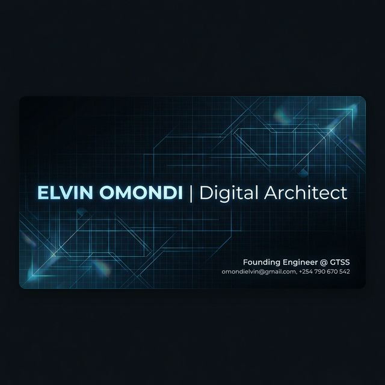

# Hi, I'm Elvin Omondi 🚀

### 
I architect enterprise-grade SaaS platforms and immersive 3D web experiences. Currently leading product development at **GTSS**, maintaining a library of **188+ reusable components** for rapid deployment.

---

### 🛠 Tech Stack
- **Frontend:** Next.js 16, React 19, TypeScript, Tailwind CSS 4, Framer Motion
- **Backend:** Node.js, PostgreSQL, Prisma, Redis, Socket.io
- **3D/Motion:** Three.js, GSAP
- **Infrastructure:** Docker, AWS S3, Vercel

---

### 📈 GitHub Stats

---

### 🏗 Featured Systems
- **JustInTime:** Hyperlocal Service Marketplace with AI matching (TensorFlow.js) & eTIMS compliance.
- **ZION-HILL:** Church Management Platform with 28-role RBAC & 135 APIs.
- **GTSS Platform:** Central hub for SaaS portfolio management & 188+ components.