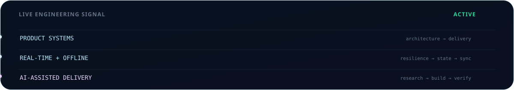
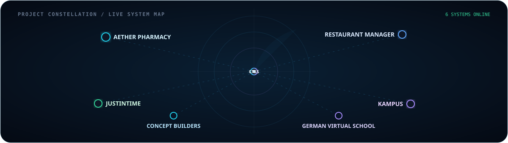
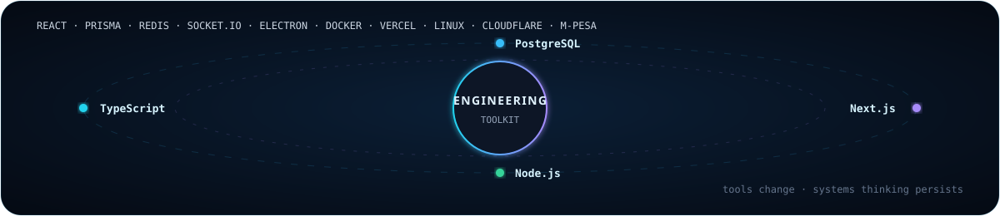
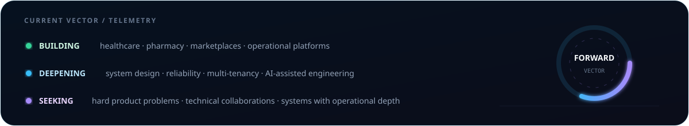

 

 

## Software that survives contact with reality.

I'm **Elvin Omondi Juma** — a full-stack product engineer, founding engineer at **GTSS**, and Computer Science student at **Moi University**.

I design and ship end-to-end products across **healthcare, local commerce, education, hospitality, and marketplaces**. Most of my work lives where software meets messy operations: multi-role access, payments, real-time state, offline constraints, back-office tooling, and users who simply need the system to work.

> **My bias:** understand the workflow deeply, reduce the complexity aggressively, then ship the smallest reliable system that can grow.

 

## What I engineer

<table>
<tr>
<td width="33%" valign="top">

### ⚙️ Product systems

Multi-tenant platforms, role-based workflows, dashboards, onboarding, internal tools, commerce, and operational software.

</td>
<td width="33%" valign="top">

### ⚡ Real-world infrastructure

M-Pesa payments, real-time events, offline-first flows, notifications, geolocation, background jobs, and integrations.

</td>
<td width="33%" valign="top">

### 🧠 AI-assisted workflows

AI features and agent-assisted engineering workflows used to move faster without giving up architecture, testing, or judgment.

</td>
</tr>
</table>

## Selected work

 

<table>
<tr>
<td width="50%" valign="top">

### 💊 Aether Pharmacy

A pharmacy operations platform built around the workflows that actually matter: inventory, prescriptions, revenue visibility, customer journeys, loyalty, and platform administration.

**Focus:** multi-tenant architecture · healthcare workflows · operations

<code>Next.js</code> <code>TypeScript</code> <code>Prisma</code> <code>PostgreSQL</code>

</td>
<td width="50%" valign="top">

### 🛠️ JustInTime

A hyperlocal services marketplace for Kenya connecting customers and providers through discovery, proposals, bookings, communication, and M-Pesa-enabled flows.

**Focus:** marketplace systems · multi-role auth · payments

<a href="https://justintime.gtss.software/">View live →</a>

<code>Next.js</code> <code>Prisma</code> <code>M-Pesa</code> <code>Real-time</code>

</td>
</tr>

<tr>
<td width="50%" valign="top">

### 🍽️ Restaurant Manager

An offline-first ordering and restaurant operations system designed to keep working on a local network even when internet connectivity is unreliable.

**Focus:** local-first architecture · POS workflows · real-time ordering

<code>Electron</code> <code>Socket.IO</code> <code>IndexedDB</code> <code>Local network</code>

</td>
<td width="50%" valign="top">

### 🎓 Kampus

A university social platform spanning community, marketplace, content, discovery, live experiences, and mobile-first student workflows.

**Focus:** social systems · mobile product · large domain model

<code>Next.js</code> <code>React Native</code> <code>Expo</code> <code>PostgreSQL</code>

</td>
</tr>

<tr>
<td width="50%" valign="top">

### 🏠 Concept Builders

A digital platform for architectural house plans and client workflows in the Kenyan market.

<a href="https://conceptbuilders.co.ke/">conceptbuilders.co.ke →</a>

<code>Next.js</code> <code>Prisma</code> <code>Product design</code>

</td>
<td width="50%" valign="top">

### 🏫 German Virtual School

A virtual learning platform for students, teachers, live classes, course administration, and day-to-day school operations.

<a href="https://germanvirtualschool.com/">germanvirtualschool.com →</a>

<code>Next.js</code> <code>Prisma</code> <code>Real-time</code>

</td>
</tr>
</table>

  Real products, operational constraints, and systems designed to be used — not just demoed.

## Engineering toolkit

 

 

| Layer | Tools I reach for |
| --- | --- |
| **Frontend** | TypeScript · Next.js · React · React Native · Tailwind CSS |
| **Backend** | Node.js · PostgreSQL · Prisma · Redis · REST APIs · server actions |
| **Real-time & desktop** | Socket.IO · Electron · local/offline-first patterns |
| **Infrastructure** | Vercel · Docker · Linux · GitHub · Cloudflare |
| **Integrations** | M-Pesa / Daraja · webhooks · notifications · maps / geolocation |
| **Workflow** | AI-assisted engineering · agentic tooling · rapid prototyping · iterative delivery |

## How I like to build

<table>
<tr>
<td width="50%" valign="top">

### 01 // START WITH THE WORKFLOW

A technically elegant system is still wrong if it misunderstands the people and operations it is supposed to serve.

</td>
<td width="50%" valign="top">

### 02 // DESIGN THE FAILURE PATH

Payments fail. Networks disappear. Jobs retry. Users double-click. The unhappy path is part of the product.

</td>
</tr>
<tr>
<td width="50%" valign="top">

### 03 // KEEP STATE EXPLICIT

Permissions, tenant boundaries, transaction state, background work, and data ownership should be obvious in the architecture.

</td>
<td width="50%" valign="top">

### 04 // USE AI AS LEVERAGE

AI can compress research, implementation, testing, and iteration — but engineering judgment still owns the final system.

</td>
</tr>
</table>

## Current vector

 

<b>◉ Open GitHub telemetry</b>

 

  
  

 

### Build something worth using.

If you're working on a product with meaningful technical or operational complexity, I'm always interested in a good engineering conversation.

<a href="mailto:omondielvin@gmail.com"><b>omondielvin@gmail.com</b></a>

  

