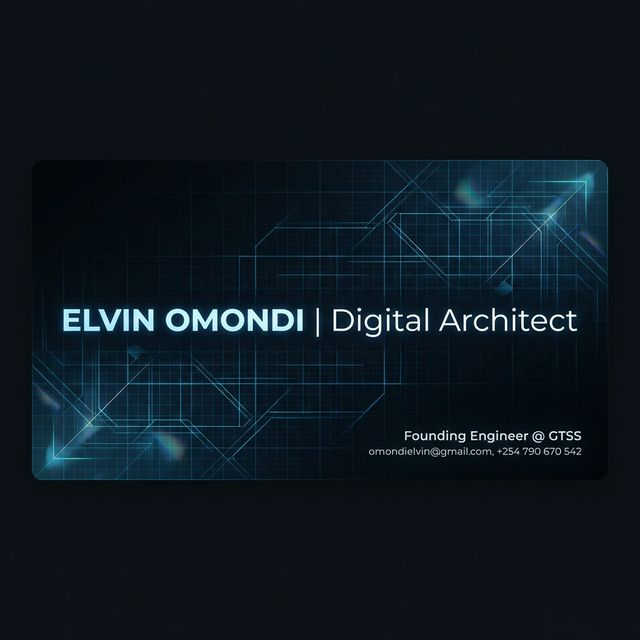

# Elvin Omondi Juma

**Software Developer · Product Builder · Computer Science Student**

I build thoughtful web products, internal systems, and digital experiences that solve practical problems.

---

## About

I'm a Kenya-based developer focused on turning ideas into useful, maintainable software.

My work sits around **full-stack web development, product interfaces, business systems, and real-world digital products**. I enjoy taking something from an early idea or rough requirement and shaping it into a polished experience people can actually use.

I care about three things in particular:

- **Clarity** — interfaces should feel obvious, not complicated.
- **Reliability** — software should behave consistently in the real world.
- **Craft** — small details matter, from responsive layouts to thoughtful interactions.

---

## What I Build

| Area | What I work on |
| --- | --- |
| **Web applications** | Full-stack applications, dashboards, portals, marketplaces and business platforms |
| **Product experiences** | Responsive UI, landing pages, interaction design and polished user flows |
| **Business systems** | Internal tools, management systems, workflows, payments and operational software |
| **Real-time products** | Messaging, notifications, live updates and collaborative experiences |

---

## Tools I Use

**Frontend**

**Backend & Data**

**Cloud & Product**

---

## Selected Work

A few projects that represent the kind of software I like building.

### Healthcare & Pharmacy
Web experiences for medical centres and pharmacies, with a focus on **clear information architecture, mobile-first UX, patient-facing journeys, and practical business functionality**.

### GTSS
Product and business software built around **content, operations, customer workflows and internal processes**.

### JustInTime
A service marketplace concept connecting customers with local service providers, exploring **matching, real-time communication and digital payments**.

### Hotel Management
An offline-first operational system for hotel teams, focused on **fast ordering, real-time updates and simple staff workflows**.

### ZION-HILL
A church management platform covering **roles, member workflows, communications and online giving**.

### German Virtual School
A virtual learning platform for **students, teachers, courses, live classes and administration**.

> More projects live across my GitHub repositories. I prefer showing the work itself over filling this page with inflated statistics.

---

## Currently

**Building:** practical digital products for businesses and organisations.

**Learning:** stronger product thinking, system design, and better ways to turn software into something genuinely useful.

**Open to:** thoughtful collaborations, interesting product ideas, and opportunities where engineering and product thinking meet.

---

## A little beyond code

I'm interested in **product design, entrepreneurship, automation, AI-assisted software development, digital business, and the intersection between technology and everyday problems**.

I don't believe good software is just about writing more code. The best result is usually the simplest product that solves the right problem well.

---

## Let's build something useful

**Have an idea, product, or problem worth solving?**

[Start a conversation](mailto:omondielvin@gmail.com)

